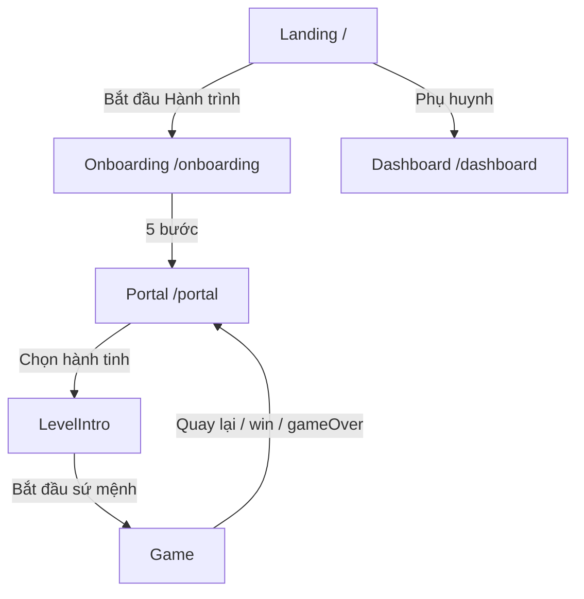

# CosmoMosaic – Tài liệu Yêu cầu Dự án
> Phiên bản: 1.0 · Cập nhật: 2026-02-28  
> Mọi tính năng mới **BẮT BUỘC** tuân thủ các quy tắc trong tài liệu này.

---

## 1. Tổng quan Sản phẩm

| Mục | Nội dung |
|---|---|
| **Tên** | CosmoMosaic – Ghép tri thức, thắp sáng vũ trụ |
| **Đối tượng** | Học sinh tiểu học Việt Nam (lớp 1–5) |
| **Thể loại** | Game giáo dục – học mà chơi |
| **Chủ đề** | Không gian neon + di sản Việt Nam |
| **Stack** | Next.js 16, Tailwind CSS, Framer Motion, Supabase |

### Câu chuyện nền
Vũ trụ CosmoMosaic bị **Băng đảng Lười Biếng** xâm chiếm. Mỗi hành tinh đại diện cho một di sản Việt Nam đang bị phong ấn. Người chơi là tân binh, được **Chỉ huy Cú Mèo** 🦉 hướng dẫn, cùng mascot đồng hành giải phóng các hành tinh bằng tri thức.

---

## 2. Kiến trúc State Management

### 2.1 GameContext (`src/lib/game-context.tsx`)
**Nguồn dữ liệu duy nhất** cho toàn bộ player state. Mọi tính năng mới **PHẢI** đọc/ghi qua GameContext.

```
GameProvider (layout.tsx)
  ├── player: PlayerData         ← state duy nhất
  ├── updatePlayer()             ← cập nhật bất kỳ field
  ├── addXP(amount)              ← tự động tính level
  ├── updatePlanetProgress()     ← cập nhật tiến trình hành tinh
  ├── useClassAbility()          ← kích hoạt năng lực
  ├── resetClassAbility()        ← reset mỗi level mới
  └── resetGame()                ← xóa toàn bộ
```

### 2.2 PlayerData Schema

```typescript
interface PlayerData {
  name: string;                    // Tên người chơi
  mascot: "cat" | "dog" | null;   // Mascot đồng hành
  playerClass: "warrior" | "wizard" | "hunter" | null;
  grade: number;                   // Lớp học (1-5)
  level: number;                   // Level game (auto-calculated)
  xp: number;                     // Điểm kinh nghiệm
  xpToNext: number;               // XP cần cho level tiếp (auto)
  streak: number;                  // Số ngày chơi liên tiếp
  totalPlayHours: number;
  onboardingComplete: boolean;
  onboardingQuizScore: number;
  planetsProgress: Record<string, PlanetProgress>;
}
```

> [!CAUTION]
> **KHÔNG tạo state riêng cho tính năng mới nếu nó liên quan đến player.** Thêm field vào `PlayerData` và cập nhật `DEFAULT_PLAYER`.

### 2.3 Persistence
- **Storage**: `localStorage` key = `"cosmomosaic_player"`
- **Hydration**: GameProvider chờ hydration xong mới render children (tránh SSR mismatch)
- **Tương lai**: Khi tích hợp Supabase Auth, đồng bộ localStorage ↔ database

---

## 3. Hệ thống Nhân vật

### 3.1 Mascot

| ID | Emoji | Tên | Vai trò |
|---|---|---|---|
| `cat` | 🐱 | Mèo Sao Băng | Đồng hành, hiển thị trên Portal |
| `dog` | 🐶 | Cún Tinh Vân | Đồng hành, hiển thị trên Portal |

> [!IMPORTANT]
> Khi thêm mascot mới: cập nhật `MASCOT_INFO` trong `game-context.tsx`, thêm option vào onboarding, và đảm bảo mascot hiển thị ở mọi nơi dùng `MASCOT_INFO[player.mascot]`.

### 3.2 Lớp nhân vật (Class)

| Class | Icon | Tên | Hiệu ứng SpaceShooter | Hiệu ứng MathForge |
|---|---|---|---|---|
| `warrior` | 🛡️ | Chiến binh Sao Băng | Miễn 1 lần sai/level (không trừ HP) | Miễn 1 lần sai/level (không trừ HP) |
| `wizard` | ⏳ | Phù thủy Tinh Vân | Bom rơi chậm 30% (`speed × 0.7`) | +5 giây timer mỗi câu |
| `hunter` | 🎯 | Thợ săn Ngân Hà | Loại 1 từ sai mỗi câu hỏi | Loại 1 đáp án sai mỗi câu |

> [!WARNING]
> Mọi game mode mới **BẮT BUỘC** implement cả 3 class abilities. Hằng số mô tả nằm trong `CLASS_ABILITIES` của `game-context.tsx`.

---

## 4. Hệ thống Hành tinh

### 4.1 Bản đồ hành tinh

| ID | Tên | Emoji | Môn học | Game Type | Levels |
|---|---|---|---|---|---|
| `ha-long` | Vịnh Hạ Long | 🏝️ | Tiếng Anh, Địa lý | SpaceShooter | 20 |
| `hue` | Cố đô Huế | 🏯 | Lịch sử, Tiếng Việt | SpaceShooter | 25 |
| `giong` | Làng Gióng | ⚔️ | Toán, Tin học | MathForge | 20 |
| `phong-nha` | Phong Nha | 🦇 | Khoa học, Địa lý | SpaceShooter | 18 |
| `hoi-an` | Phố cổ Hội An | 🏮 | Mỹ thuật, Tiếng Anh | SpaceShooter | 15 |
| `sapa` | Ruộng bậc thang Sa Pa | 🌾 | Toán, Khoa học | MathForge | 22 |

### 4.2 Quy tắc thêm hành tinh mới
1. Thêm entry vào `mockPlanets` trong `mock-data.ts`
2. Thêm `PlanetProgress` vào `DEFAULT_PLAYER.planetsProgress` trong `game-context.tsx`
3. Tạo level data (`mockXxxLevels`) trong `mock-data.ts`
4. Thêm vào `PLANET_LEVELS` + `PLANET_NAMES` trong page tương ứng (`play/page.tsx` hoặc `play/math/page.tsx`)
5. Routing tự động qua query param `?planet=<id>`
6. Thêm story intro vào `storyIntros` trong `LevelIntro.tsx`

### 4.3 Planet Routing Logic
```
Portal page.tsx:
  planet.id ∈ {"giong", "sapa"} → /portal/play/math?planet=<id>   (MathForge)
  planet.id ∈ {còn lại}         → /portal/play?planet=<id>         (SpaceShooter)
```

---

## 5. Game Modes

### 5.1 SpaceShooterGame (`src/components/SpaceShooterGame.tsx`)

**Mô tả**: Bắn từ không gian – người chơi điều khiển tàu, bắn chọn từ/đáp án đúng.

**Props bắt buộc**:
```typescript
interface Props {
  levels: GameLevel[];
  onExit?: () => void;
  playerClass?: "warrior" | "wizard" | "hunter" | null;
  onGameComplete?: (finalScore: number, levelsCompleted: number) => void;
}
```

**Luật chơi**:
| Quy tắc | Giá trị |
|---|---|
| HP tối đa | 3 ❤️ |
| XP mỗi câu đúng | +100 |
| Mất HP khi | Bắn trúng từ SAI hoặc từ ĐÚNG rơi khỏi màn hình |
| Game Over khi | HP = 0 |
| Win khi | Hoàn thành tất cả questions của tất cả levels |
| Level data format | `{ level, planet, subject, title, speed, questions[] }` |
| Question format | `{ question, correctWord, wrongWords[] }` |

**Game States**: `ready` → `playing` → `levelComplete` → `playing` → ... → `win` / `gameOver`

### 5.2 MathForgeGame (`src/components/MathForgeGame.tsx`)

**Mô tả**: Lò Rèn Vũ Trụ – kéo thả hoặc click chọn số điền vào phương trình.

**Props bắt buộc**:
```typescript
interface Props {
  levels: MathLevel[];
  onExit?: () => void;
  playerClass?: "warrior" | "wizard" | "hunter" | null;
  onGameComplete?: (finalScore: number, levelsCompleted: number) => void;
}
```

**Luật chơi**:
| Quy tắc | Giá trị |
|---|---|
| HP tối đa | 3 ❤️ |
| XP mỗi câu đúng | +100 × combo multiplier |
| Combo bonus | ×1.5 khi ≥3 câu đúng liên tiếp |
| Timer | `timePerQuestion` giây/câu (default 15s) |
| Mất HP khi | Chọn sai hoặc hết giờ |
| Level data format | `{ level, planet, subject, title, timePerQuestion, questions[] }` |
| Question format | `{ equation, answer, options[] }` |

### 5.3 Quy tắc thêm Game Mode mới

> [!IMPORTANT]
> Mọi game mode mới **PHẢI** tuân thủ:

1. **Nhận props**: `playerClass` + `onGameComplete(finalScore, levelsCompleted)`
2. **Implement 3 class abilities**: warrior (shield/miễn sai), wizard (thêm thời gian/giảm tốc), hunter (loại bỏ đáp án sai)
3. **Gọi `onGameComplete`**: khi `win` hoặc `gameOver` để cập nhật XP và planet progress
4. **Hỗ trợ HP/Score**: sử dụng MAX_HP = 3, +100 XP mỗi câu đúng làm cơ sở
5. **Game states**: phải có `ready`, `playing`, `levelComplete`, `win`, `gameOver`
6. **Fullscreen**: hỗ trợ toggle fullscreen

---

## 6. User Flow

### 6.1 Flow chính


### 6.2 Onboarding (5 bước)
1. **Welcome** – Giới thiệu "Tân Binh"
2. **Mascot** – Chọn mascot đồng hành (cat/dog)
3. **Quiz** – 4 câu hỏi (Toán, Tiếng Anh, Địa lý, Tiếng Việt)
4. **Class** – Chọn lớp nhân vật (warrior/wizard/hunter)
5. **Ready** – Xác nhận → **lưu tất cả vào GameContext** → navigate `/portal`

> [!CAUTION]
> Onboarding **PHẢI** gọi `updatePlayer()` trước khi navigate. Nếu không, dữ liệu sẽ mất.

### 6.3 LevelIntro Component
Hiển thị trước mỗi game, bao gồm:
- Chỉ huy Cú Mèo 🦉 với câu chuyện `storyIntros[planetName]`
- Tên hành tinh + emoji
- Level number + title + subject
- Class ability notice tương ứng
- Nút "Bắt đầu sứ mệnh!"

---

## 7. Hệ thống XP & Level

```
XP_PER_LEVEL = 500

Level = floor(totalXP / 500) + 1
xpToNext = level × 500

Ví dụ:
  0 XP    → Level 1, cần 500
  500 XP  → Level 2, cần 1000
  1000 XP → Level 3, cần 1500
```

**Nguồn XP**:
- SpaceShooterGame: +100 XP mỗi từ đúng
- MathForgeGame: +100 XP × combo mỗi câu đúng

> [!IMPORTANT]
> XP **chỉ được cộng thông qua** `addXP()` hoặc `onGameComplete()`. KHÔNG set trực tiếp `player.xp`.

---

## 8. Dashboard Phụ huynh (`/dashboard`)

Hiển thị:
- **StatsCards**: XP, thời gian chơi, streak, hành tinh hoàn thành
- **ProgressChart**: Biểu đồ tiến trình theo tuần
- **SubjectBreakdown**: Phân tích điểm theo môn
- **AIInsights**: Gợi ý AI tự động

> [!NOTE]
> Dashboard hiện dùng `mockStudent` + mock data. Khi tích hợp Supabase, cần đọc từ database thay vì mock.

---

## 9. Cấu trúc Files

```
src/
├── app/
│   ├── layout.tsx            ← Wrap <Providers>
│   ├── providers.tsx         ← Client wrapper cho GameProvider
│   ├── page.tsx              ← Landing page
│   ├── globals.css           ← Design tokens + animations
│   ├── onboarding/page.tsx   ← 5-step onboarding
│   ├── portal/
│   │   ├── page.tsx          ← Planet map + player sidebar
│   │   └── play/
│   │       ├── page.tsx      ← SpaceShooter (query: ?planet=)
│   │       └── math/page.tsx ← MathForge (query: ?planet=)
│   └── dashboard/page.tsx    ← Parent dashboard
├── components/
│   ├── SpaceShooterGame.tsx  ← Canvas-based shooter
│   ├── MathForgeGame.tsx     ← Drag-n-drop math
│   ├── LevelIntro.tsx        ← Story intro trước game
│   ├── Navbar.tsx            ← Navigation bar
│   ├── GlassCard.tsx         ← Glass morphism card
│   ├── NeonButton.tsx        ← Styled button
│   ├── PlanetIcon.tsx        ← SVG planet icon
│   ├── StarField.tsx         ← Star particle background
│   ├── ChallengePlanets.tsx  ← Landing page planets
│   ├── MascotAI.tsx          ← AI mascot widget
│   └── dashboard/            ← Dashboard sub-components
└── lib/
    ├── game-context.tsx      ← ⭐ STATE DUY NHẤT
    ├── mock-data.ts          ← Tất cả game data
    └── supabase.ts           ← Supabase client
```

---

## 10. Design System

### 10.1 Colors
| Token | Hex | Dùng cho |
|---|---|---|
| `--space-deep` | `#0A0E27` | Background chính |
| `--space-mid` | `#131842` | Card background |
| `--neon-cyan` | `#00F5FF` | Primary accent |
| `--neon-magenta` | `#FF6BFF` | Secondary accent |
| `--neon-gold` | `#FFE066` | Highlight, XP, rewards |
| `--neon-green` | `#7BFF7B` | Success, correct |

### 10.2 Typography
- **Headings**: `Outfit` (700–900)
- **Body**: `Inter` (300–600)

### 10.3 UI Patterns
- **Glass Cards**: `glass-card`, `glass-card-strong`
- **Neon Glow**: `neon-glow`, `neon-glow-magenta`, `neon-glow-gold`
- **Animations**: `animate-float`, `animate-float-slow`, `animate-glow-pulse`

---

## 11. Checklist cho Tính năng Mới

Trước khi phát triển bất kỳ tính năng mới nào, kiểm tra:

- [ ] Dữ liệu player lưu qua `GameContext` (KHÔNG dùng useState riêng cho data player)
- [ ] Nếu thêm field vào PlayerData → cập nhật `DEFAULT_PLAYER`
- [ ] Nếu thêm hành tinh → cập nhật cả `mockPlanets`, `DEFAULT_PLAYER.planetsProgress`, routing, và `LevelIntro.storyIntros`
- [ ] Nếu thêm game mode → implement 3 class abilities + `onGameComplete` callback
- [ ] Nếu thêm mascot/class → cập nhật `MASCOT_INFO` / `CLASS_ABILITIES` + onboarding UI
- [ ] XP chỉ cộng qua `addXP()`, KHÔNG set trực tiếp
- [ ] LevelIntro hiển thị trước khi bắt đầu game
- [ ] Chỉ huy Cú Mèo 🦉 xuất hiện trong narrative mới
- [ ] Dashboard phụ huynh phản ánh dữ liệu mới (khi applicable)
- [ ] Tuân thủ design system: neon colors, glass cards, Outfit/Inter fonts
